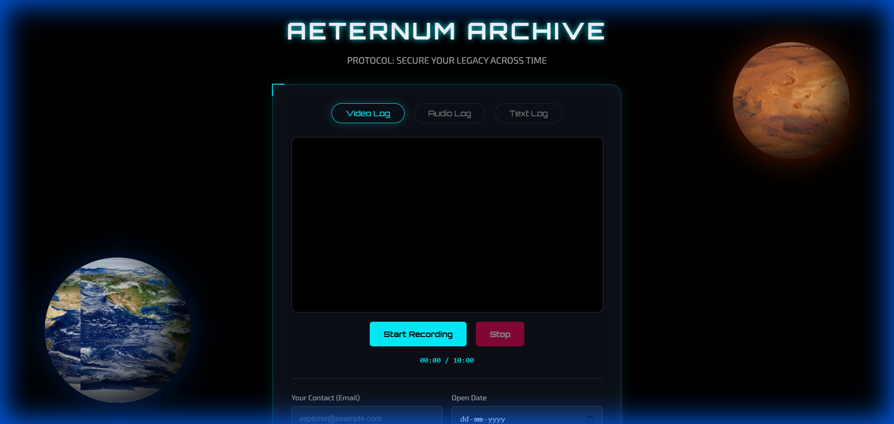
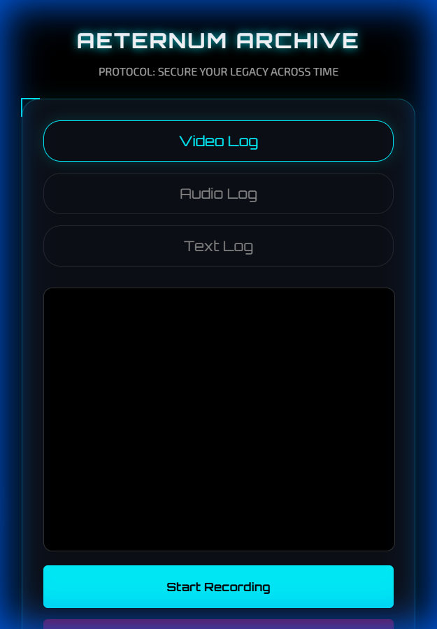

# AETERNUM ARCHIVE 🚀⏳
### *Secure Your Legacy Across Time*



> "I knew there are other tools in the market, but I wanted to build one for me. Not feeling to sleep in night, so just started vibe coded."

**Aeternum Archive** (formerly Chronos) is a time capsule application that lets you record video, audio, or text messages for your future self. It encrypts your memories using military-grade protocols and ensures they remain locked until a date you choose.

---

## 🌌 Features

- **Standard Encryption**: Uses **Fernet (AES-128)** to lock your files.
- **Privacy First**: The server does NOT store your video/audio files. You download the encrypted "Capsule" (.enc) immediately. The server only keeps the key.
- **Space Theme UI**: Immersive dark mode design with rotating 3D planets (Mars & Earth).
- **Responsive**: "Vibe coded" to look amazing on both Laptops and Mobile phones.

### 📱 Mobile Experience


---

## 🔓 How to Decrypt Your Capsule

When the future arrives (or if you just want to test it), follow these steps to unlock your memories:

1.  **Launch the App**: Make sure the server is running (`python app.py`) and go to the home page.
2.  **Locate the Decrypt Link**: Scroll to the bottom of the page and click the glowing **"DECRYPT EXISTING CAPSULE"** button (or visit `/decrypt`).
3.  **Upload & Verify**:
    *   **Upload your `.enc` file**: This is the file you downloaded when you created the capsule.
    *   **Enter Credentials**: Type in the **Email** you used and the **Capsule ID** (if you have it).
    *   *Or* **Manual Key**: If you saved your backup key string, you can paste that directly by expanding the "I have my backup key" section.
4.  **Unlock**: Click **"Decrypt & Restore"**.
    *   If the Release Date has passed, your message (Video/Audio/Text) will immediately play or display on the screen.
    *   If the date hasn't passed yet, the system will block the attempt! ⏳

---

## 🤓 For the Nerds: How it Works

1.  **Browser Recording**: We use the `MediaStream Recording API` to capture your webcam/microphone directly in the browser.
2.  **Encryption**: 
    *   We use the **Fernet** implementation from the `cryptography` Python library.
    *   **Algorithm**: AES in CBC mode with a 128-bit key for encryption; HMAC using SHA256 for authentication.
    *   **Why?** This ensures that even if someone gets your file, they cannot open it without the key. It also prevents tampering—if a single bit is changed in the file, it will fail to decrypt.
3.  **Key Storage**: Your specific decryption key is generated on the server and stored in a local SQLite database (`capsules.db`) alongside your chosen release date.
4.  **Zero-Knowledge Storage**: The heavy video file never stays on our server. It is encrypted in RAM and streamed back to you instantly.

---

## 🛠️ Run Locally

Want to run this on your own computer? It's designed to be plug-and-play.

### Prerequisites
- Python 3.7+
- A webcam/microphone (for recording)

### Setup

1.  **Clone the Repo**
    ```bash
    git clone https://github.com/YOUR_USERNAME/aeternum-archive.git
    cd aeternum-archive
    ```

2.  **Install Dependencies**
    ```bash
    pip install flask cryptography
    ```

3.  **Run the App**
    ```bash
    python app.py
    ```

4.  **Launch**
    Open your browser and explore the cosmos at:
    `http://127.0.0.1:5000`

---

## 🛸 Chrome Extension
This project includes a prototype Chrome Extension!
1.  Go to `chrome://extensions/`
2.  Enable "Developer Mode".
3.  Click "Load Unpacked" and select the `chrome_extension` folder in this repo.

---

*Built with Python, Flask, and Stardust.*
